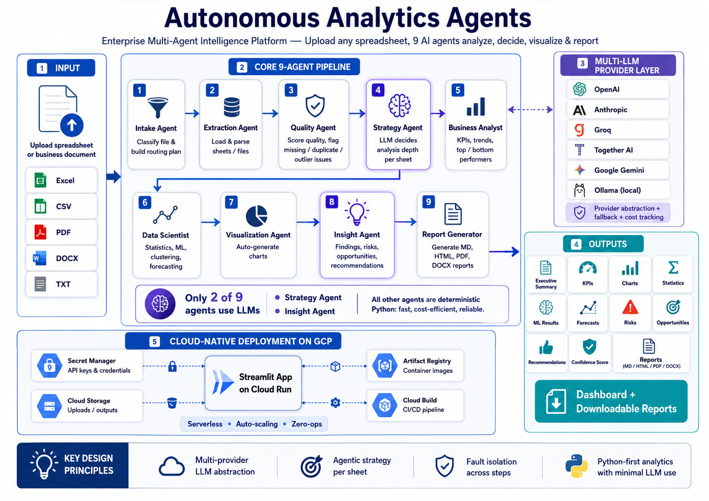
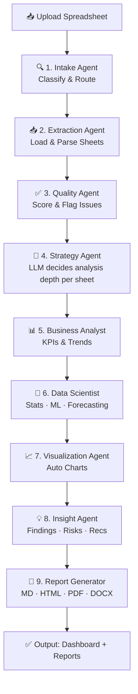

<!-- ─────────────────────────────────────────────────────────────── -->
<!--  Autonomous Analytics Agents — Enterprise Multi-Agent Intelligence Platform       -->
<!-- ─────────────────────────────────────────────────────────────── -->

<p align="center">
  
  
  
  
  
</p>

<h1 align="center">⚡ Autonomous Analytics Agents</h1>
<h3 align="center">Upload any spreadsheet — 9 AI agents analyze, decide, visualize & report</h3>
<p align="center">
  <b>Zero manual work.</b> Drop an Excel or CSV file. The agents handle data quality,<br/>
  strategic analysis decisions, KPIs, statistics, ML, forecasting, charts,<br/>
  and professional reports — powered by <b>any LLM provider</b> you choose.
</p>

---

## ✨ Why This Project Exists

Modern business intelligence is **fragmented**. You jump between Excel for analysis, a BI tool for dashboards, a web browser for research, and a report writer for documentation. Then you manually piece together insights.

**Autonomous Analytics Agents** replaces that entire workflow with **9 autonomous AI agents** that collaborate in a single pipeline. Upload a spreadsheet — the agents handle everything, from data quality scoring to professional report generation.

---

## 🏗️ Architecture

<p align="center">
  
</p>

### Agent Pipeline



| # | Agent | Role | LLM? |
|---|-------|------|:----:|
| 1 | **Intake** | Classifies file types, builds routing plan | ❌ |
| 2 | **Extraction** | Loads Excel/CSV/PDF/DOCX/TXT | ❌ |
| 3 | **Quality** | Scores data quality, identifies missing/duplicate/outlier issues | ❌ |
| 4 | **Strategy** 🧠 | **LLM decides** per-sheet: run ML? forecast? charts? based on data characteristics | ✅ |
| 5 | **Analyst** | Computes KPIs, trends, top/bottom performers | ❌ |
| 6 | **Scientist** | Correlation, clustering, ARIMA/Prophet forecasting | ❌ |
| 7 | **Visualization** | Auto-generates charts (bar/line/scatter/heatmap/distribution/pie) | ❌ |
| 8 | **Insight** | Synthesizes executive summary, findings, risks, opportunities | ✅ |
| 9 | **Report** | Produces MD, HTML, PDF, DOCX reports | ❌ |

> **Key design:** Only 2 of 9 agents use LLM (Strategy + Insight). The rest are deterministic Python — fast, cheap, reliable.

---

## 🚀 Quick Start

### Prerequisites
- **Python 3.12+**
- **At least one LLM API key** (OpenAI, Anthropic, Groq, Together AI, or Google Gemini)
  — or [Ollama](https://ollama.com) running locally for zero-cost inference.

### 1. Clone & Install

```bash
git clone https://github.com/yourusername/autonomous-analytics-agents.git
cd autonomous-analytics-agents

python -m venv .venv
source .venv/bin/activate        # Windows: .venv\Scripts\activate

pip install -r requirements.txt
```

### 2. Configure API Keys

```bash
cp .env.example .env
# Edit .env with your API keys. At minimum:
#   OPENAI_API_KEY=sk-...
```

**Supported providers** (just add the key to `.env`):

| Provider | Env Variable | Free Tier? | Best For |
|---|---|---|---|
| OpenAI | `OPENAI_API_KEY` | ❌ | General purpose, best quality |
| Anthropic | `ANTHROPIC_API_KEY` | ❌ | Long-form analysis, reasoning |
| Groq | `GROQ_API_KEY` | ✅ | Fastest inference (LPU) |
| Together AI | `TOGETHER_API_KEY` | ✅ ($1 credit) | Open-source models |
| Google Gemini | `GOOGLE_API_KEY` | ✅ | Multimodal, large context |
| Ollama | *(none needed)* | ✅ | Fully local, zero cost |

### 3. Run

```bash
# Streamlit Dashboard (recommended)
streamlit run app/streamlit_app.py

# CLI mode
python main.py --files data/sales.xlsx
python main.py --provider groq --files data.csv
python main.py --list-providers
```

Open http://localhost:8501

### 4. Try the Demo

```bash
# Generate sample datasets
python scripts/generate_demo_data.py      # Sales & marketing data (3 sheets)
python scripts/generate_saas_data.py       # SaaS startup metrics (3 sheets)

# Upload both to the dashboard and see 9 agents analyze 6 sheets simultaneously
```

---

## 🐳 Docker

```bash
# Cloud-only (OpenAI, Anthropic, etc.)
docker compose up -d --build

# With local Ollama fallback
docker compose --profile local up -d --build

open http://localhost:8501
```

---

## ☁️ Google Cloud Deployment

Autonomous Analytics Agents is designed for one-click deployment to **Google Cloud Run** — fully serverless, auto-scaling, zero-ops.

### Architecture on GCP

```
┌─────────────────────────────────────────────────────┐
│                    Cloud Run                         │
│  ┌──────────────────────────────────────────────┐   │
│  │     Autonomous Analytics Agents (Streamlit)   │   │
│  │     us-central1-docker.pkg.dev/...            │   │
│  └──────────────────────────────────────────────┘   │
│         │                    │                      │
│         ▼                    ▼                      │
│  ┌──────────────┐   ┌──────────────────┐            │
│  │ Secret        │   │ Cloud Storage     │           │
│  │ Manager       │   │ (uploads/outputs) │           │
│  │ (API keys)    │   │                   │           │
│  └──────────────┘   └──────────────────┘            │
│                                                      │
│  ┌──────────────┐   ┌──────────────────┐            │
│  │ Artifact      │   │ Cloud Build       │           │
│  │ Registry      │   │ (CI/CD pipeline)  │           │
│  └──────────────┘   └──────────────────┘            │
└─────────────────────────────────────────────────────┘
```

### Option A: One-Command Deploy (Recommended)

```bash
# 1. Install gcloud CLI & authenticate
gcloud auth login
gcloud config set project YOUR_PROJECT_ID

# 2. Set your API keys as env vars
set OPENAI_API_KEY=sk-...           # Windows
export OPENAI_API_KEY="sk-..."      # macOS/Linux

# 3. Deploy!
chmod +x scripts/deploy-gcp.sh
./scripts/deploy-gcp.sh
```

> 📖 **New to GCP?** Step-by-step guide with explanations: **[GUIDE.md](GUIDE.md)** (Türkçe) | **[GUIDE_EN.md](GUIDE_EN.md)** (English) — zero to deployed in 30 minutes.

The script handles: API enabling → Artifact Registry → GCS bucket → Secret Manager → Docker build → Cloud Run deploy.

### Option B: Terraform (Infrastructure as Code)

```bash
cd terraform
cp terraform.tfvars.example terraform.tfvars
# Edit terraform.tfvars with your project ID and API keys

terraform init
terraform plan
terraform apply

# After Terraform provisions infrastructure, deploy the app:
gcloud builds submit --config=cloudbuild.yaml
```

### Option C: CI/CD with Cloud Build

```bash
# One-time trigger setup (GitHub auto-deploy on push to main)
gcloud builds triggers create github \
  --repo=github.com/yourusername/autonomous-analytics-agents \
  --branch=main \
  --build-config=cloudbuild.yaml \
  --substitutions=_GCS_BUCKET_NAME=analytics-agents-storage

# After that, every git push to main auto-deploys ✨
```

### Post-Deployment

```bash
# Get the service URL
gcloud run services describe analytics-agents --region=us-central1 --format="value(status.url)"

# Monitor logs
gcloud logging read "resource.type=cloud_run_revision AND resource.labels.service_name=analytics-agents" --limit=20

# Teardown everything
./scripts/teardown-gcp.sh
```

> 💡 **GCP Free Tier covers:** Cloud Run (2M req/month), Cloud Build (120 min/day), Secret Manager (6 secrets), Cloud Storage (5GB). Small instances cost ~$0/day for light usage.

---

## 📊 What You Get

Every pipeline run produces:

| Output | Details |
|---|---|
| 📋 **Executive Summary** | 2–3 paragraph AI-generated narrative |
| 🔑 **KPIs** | Growth rates, trends, top/bottom performers |
| 📈 **Charts** | Auto-generated bar, line, pie, scatter, heatmap, distribution |
| 🔬 **Statistics** | Correlation matrix, hypothesis tests, regression |
| 🤖 **ML Results** | AutoML classification, regression, clustering |
| 📉 **Forecast** | ARIMA / Prophet time-series predictions |
| ⚠️ **Risks** | Multi-collinearity, volatility, data quality flags |
| 💡 **Opportunities** | Revenue, cost-savings, efficiency recommendations |
| ✅ **Recommendations** | Short-term actions + long-term strategy |
| 🎯 **Confidence Score** | 0–100 composite confidence |
| 📄 **Reports** | Downloadable MD, HTML, PDF, DOCX |

---

## 🧩 Project Structure

```
autonomous-analytics-agents/
├── config/
│   └── settings.py              # Pydantic settings — all providers, paths, budgets
├── src/
│   ├── llm/                     # Multi-provider LLM abstraction
│   │   ├── base.py              # Abstract BaseLLMProvider
│   │   ├── openai_provider.py   # GPT-4o-mini, GPT-4o
│   │   ├── anthropic_provider.py # Claude 3 Haiku/Sonnet
│   │   ├── groq_provider.py     # Llama 3 via LPU
│   │   ├── together_provider.py # Llama 3 via Together
│   │   ├── google_provider.py   # Gemini 1.5 Flash/Pro
│   │   ├── ollama_provider.py   # Local models (Qwen, Llama, Mistral)
│   │   └── factory.py           # Provider factory + fallback + cost tracking
│   ├── agents/                  # Agent definitions (no framework required)
│   ├── workflow/                # Pipeline orchestration
│   │   ├── state.py             # PipelineState + SheetResult
│   │   └── graph.py             # 9-step agent pipeline
│   ├── ingestion/               # File loaders
│   │   └── file_loaders.py      # Excel, CSV, PDF, DOCX, TXT
│   ├── quality/                 # Data quality
│   │   └── scorer.py            # Quality scoring + auto-cleaning
│   ├── analytics/               # Data science
│   │   ├── kpi.py               # KPI extraction
│   │   ├── statistics.py        # Hypothesis tests, regression
│   │   ├── automl.py            # Classification, regression, clustering
│   │   └── forecasting.py       # ARIMA + Prophet
│   ├── viz/
│   │   └── chart_engine.py      # Auto chart generation
│   ├── rag/
│   │   └── store.py             # ChromaDB vector store + RAG Q&A
│   ├── insights/
│   │   └── generator.py         # Findings, risks, opportunities, confidence
│   └── reporting/
│       └── generator.py         # Jinja2 → MD, HTML, PDF, DOCX
├── app/
│   └── streamlit_app.py         # Professional Streamlit dashboard
├── tests/                       # Pytest test suite
├── scripts/                     # Demo data generators + deploy scripts
├── terraform/                   # GCP infrastructure as code
├── data/                        # Uploads, outputs (gitignored)
├── main.py                      # CLI entry point
├── cloudbuild.yaml              # CI/CD pipeline
├── Dockerfile
├── docker-compose.yml
├── pyproject.toml
├── requirements.txt
└── GUIDE.md                     # Step-by-step GCP deployment guide
```

---

## 🔧 Configuration Reference

All settings in `.env`:

| Variable | Default | Description |
|---|---|---|
| `LLM_PROVIDER` | `openai` | Primary LLM provider |
| `OPENAI_API_KEY` | — | OpenAI API key |
| `ANTHROPIC_API_KEY` | — | Anthropic API key |
| `GROQ_API_KEY` | — | Groq API key |
| `TOGETHER_API_KEY` | — | Together AI API key |
| `GOOGLE_API_KEY` | — | Google Gemini API key |
| `FIRECRAWL_API_KEY` | — | Firecrawl API key (optional) |
| `CHROMA_PERSIST_DIR` | `./data/chroma` | Vector store location |
| `MAX_DAILY_SPEND_USD` | `5.0` | Budget guardrail |
| `LLM_TEMPERATURE` | `0.3` | LLM creativity (0–1) |

---

## 🧪 Running Tests

```bash
pytest tests/ -v
pytest tests/ --cov=src --cov-report=html   # with coverage
```

---

## 🛠️ Design Decisions

Why this architecture demonstrates Principal-level engineering:

1. **Multi-provider LLM abstraction** — Not locked into one vendor. The `BaseLLMProvider` interface with automatic fallback across 6 providers demonstrates production-grade API design. Built-in per-call cost tracking.

2. **LLM discipline** — Only 2 of 9 agents use LLMs (Strategy + Insight). Statistics, ML, and charts run in plain Python. This minimizes cost (~$0.001/run) and maximizes reliability.

3. **Strategic agentic decision-making** — The Strategy Agent evaluates each sheet's characteristics (row count, quality score, column types) via LLM and decides which analyses to run. This is true agentic behavior — not a hardcoded pipeline.

4. **Zero-framework pipeline** — Custom orchestration without LangGraph, CrewAI, or other heavy dependencies. The entire pipeline is ~400 lines of readable, debuggable Python.

5. **Fault isolation** — Every pipeline step is wrapped in try/except. One failing agent never crashes the entire pipeline.

6. **Cloud-native from day one** — Secret Manager for credentials, Cloud Storage for persistence, Cloud Run for serverless hosting, Terraform for IaC, Cloud Build for CI/CD.

---

## 📄 License

MIT — see [LICENSE](LICENSE) file.

---

## 🤝 Contributing

Contributions welcome! Open an issue or PR. Areas of interest:

- Additional LLM providers (Mistral, Cohere, Replicate, Azure OpenAI)
- More document formats (PPTX, Google Sheets)
- Async pipeline with message queue (Pub/Sub, Kafka)
- Streaming LLM responses for real-time insight generation
- Advanced monitoring with Cloud Monitoring + alerting

---